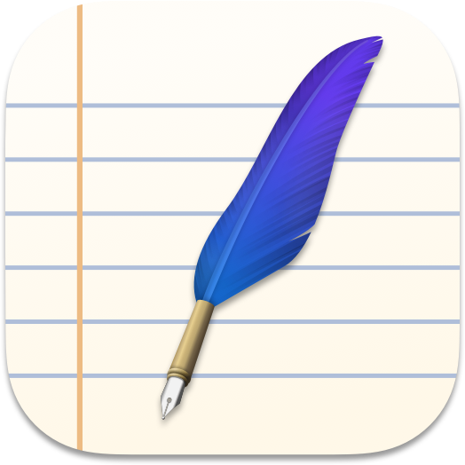
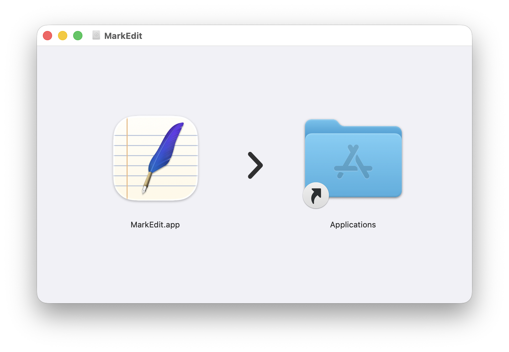

# MarkEdit

 

MarkEdit is a free and **open-source** Markdown editor, for macOS. It's just like _TextEdit_ on Mac but dedicated to `Markdown`.

> [!TIP]
> Discover our other free and open-source apps at [libremac.github.io](https://libremac.github.io/).

## Screenshots

## What makes MarkEdit different

- Privacy-focused: doesn't collect any user data
- Native: clean and intuitive, feels right at home on Mac
- Fast: edits 10 MB files easily
- Lightweight: installer size is about 3 MB
- Extensible: seamless Shortcuts integration

MarkEdit is designed to be simple and easy to use. You can also customize the UI and behavior by adding your own scripts, including utilizing CodeMirror extensions.

To learn more, refer to [Philosophy](https://github.com/MarkEdit-app/MarkEdit/wiki/Philosophy), [Why MarkEdit](https://github.com/MarkEdit-app/MarkEdit/wiki/Why-MarkEdit) and [MarkEdit-api](https://github.com/MarkEdit-app/MarkEdit-api).

## Installation

Get `MarkEdit.dmg` from the <a href="https://github.com/MarkEdit-app/MarkEdit/releases/latest" target="_blank">latest release</a>, open it, and drag `MarkEdit.app` to `Applications`.

MarkEdit checks for updates automatically. You can also check manually via the main `MarkEdit` menu, or browse version history [here](https://github.com/MarkEdit-app/MarkEdit/releases).

If you prefer a [Homebrew](https://brew.sh/) installation, run `brew install markedit` in your terminal and you're all set.

> We used to publish MarkEdit to the Mac App Store, [but no longer](https://github.com/MarkEdit-app/MarkEdit/wiki/Philosophy#be-a-good-macos-citizen). Don't worry about the security warning; releases are signed with a certificate from an identified developer and [notarized](https://developer.apple.com/documentation/security/notarizing_macos_software_before_distribution).

## Platform Compatibility

To be focused, we only support the latest two major macOS releases. For now, they are [macOS Sonoma](https://www.apple.com/newsroom/2023/09/macos-sonoma-is-available-today/) and [macOS Sequoia](https://www.apple.com/macos/macos-sequoia/).

Last-compatible version tags: [macos-12](https://github.com/MarkEdit-app/MarkEdit/releases/tag/macos-12), [macos-13](https://github.com/MarkEdit-app/MarkEdit/releases/tag/macos-13).

## Why MarkEdit is free

MarkEdit is completely free and open-source, with no advertising or promotions for other services. We make it mostly because we need it, and we ship it just in case you need it too.

Please consider starring or contributing to this project.

> For everyone's convenience, MarkEdit is licensed under the MIT license. However, please don't upload the app to the Mac App Store unless you add meaningful new value (see [also](https://github.com/MarkEdit-app/MarkEdit/wiki#last-but-not-least)).

## Using MarkEdit

Please refer to the [wiki page](https://github.com/MarkEdit-app/MarkEdit/wiki/Manual) for details.

## Development

Please refer to the [wiki page](https://github.com/MarkEdit-app/MarkEdit/wiki/Development) for details.

## Contributing to MarkEdit

For bug reports, please [open an issue](https://github.com/MarkEdit-app/MarkEdit/issues/new).

For code changes, bug fixes are generally welcomed, feel free to [open pull requests](https://github.com/MarkEdit-app/MarkEdit/compare). However, we hesitate to add new features ([why](https://github.com/MarkEdit-app/MarkEdit/wiki/Why-MarkEdit#feature-poor)); please fork the repository and make your own.

For localization, please also open an issue as mentioned above first.

Thanks in advance.

## Acknowledgments

MarkEdit is built on top of the awesome [CodeMirror 6](https://codemirror.net/) project.

MarkEdit uses [ts-gyb](https://github.com/microsoft/ts-gyb) to generate lots of boilerplate code.
