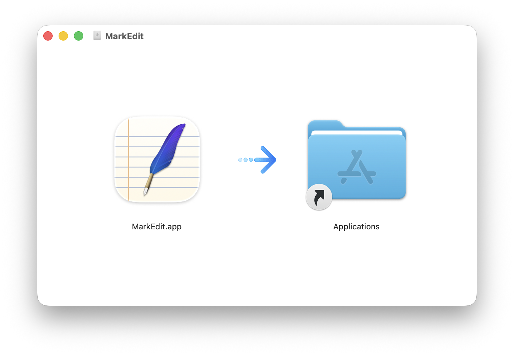

<picture>
  <source media="(prefers-color-scheme: light)" srcset="https://raw.githubusercontent.com/MarkEdit-app/MarkEdit/main/Icon.png" width="96">
  <source media="(prefers-color-scheme: dark)" srcset="https://raw.githubusercontent.com/MarkEdit-app/MarkEdit/main/Icon-dark.png" width="96">
  
</picture>

# MarkEdit

 

MarkEdit is a free and **open-source** Markdown editor, for macOS. It's just like _TextEdit_ on Mac but dedicated to `Markdown`.

Fast, clean, and bloat-free, with the maturity to get text editing right.

> [!TIP]
> Discover our other free and open-source apps at [libremac.github.io](https://libremac.github.io/).
>
> Follow our Mastodon account [@MarkEditApp](https://mastodon.social/@MarkEditApp) for the latest updates.

## Preview

## What makes MarkEdit different

- Privacy-focused: doesn't collect any user data
- Native: clean and intuitive, feels right at home on Mac
- Fast: edits 10 MB files easily
- Lightweight: installer size is about 4 MB
- Extensible: seamless integration with Shortcuts and AppleScript

MarkEdit strictly follows the [GFM specification](https://github.github.com/gfm/), with no proprietary syntax or invented features. Complex editing like multi-caret and code folding is built on [CodeMirror 6](https://codemirror.net/) for correctness and performance, consistently faster than most macOS editors. UI controls remain native to macOS in both aesthetics and behavior, including force-touch word lookup, inline predictions, and Writing Tools.

Customization is built around CSS, JavaScript, and [CodeMirror extensions](https://github.com/MarkEdit-app/MarkEdit-api). Official extensions include [MarkEdit-preview](https://github.com/MarkEdit-app/MarkEdit-preview) for a preview pane, [MarkEdit-theming](https://github.com/MarkEdit-app/MarkEdit-theming) for custom themes, and [MarkEdit-ai-writer](https://github.com/MarkEdit-app/MarkEdit-ai-writer) for Apple Intelligence on macOS Tahoe.

> To learn more, refer to [Philosophy](https://github.com/MarkEdit-app/MarkEdit/wiki/Philosophy), [Why MarkEdit](https://github.com/MarkEdit-app/MarkEdit/wiki/Why-MarkEdit) and [MarkEdit-api](https://github.com/MarkEdit-app/MarkEdit-api).

## Installation

Get `MarkEdit.dmg` from the <a href="https://github.com/MarkEdit-app/MarkEdit/releases/latest" target="_blank">latest release</a>, open it, and drag `MarkEdit.app` to `Applications`. Or install via [Homebrew](https://brew.sh/): `brew install --cask markedit`.

MarkEdit checks for updates automatically; you can also browse version history [here](https://github.com/MarkEdit-app/MarkEdit/releases).

For older macOS: [macos-12](https://github.com/MarkEdit-app/MarkEdit/releases/tag/macos-12), [macos-13](https://github.com/MarkEdit-app/MarkEdit/releases/tag/macos-13), [macos-14](https://github.com/MarkEdit-app/MarkEdit/releases/tag/macos-14).

## Using MarkEdit

Please refer to the [wiki page](https://github.com/MarkEdit-app/MarkEdit/wiki/Manual) for details. Check out [MarkEdit-skill](https://github.com/MarkEdit-app/MarkEdit-skill) if you're interested in managing MarkEdit with an AI agent.

## Why MarkEdit is free

MarkEdit is a tool we use every day and keep improving for ourselves. We ship it openly, hoping it's useful to others with the same needs.

## Contributing to MarkEdit

For bugs, [open an issue](https://github.com/MarkEdit-app/MarkEdit/issues/new) or [pull request](https://github.com/MarkEdit-app/MarkEdit/compare). For behavior changes, discuss first; MarkEdit is intentionally minimal ([why](https://github.com/MarkEdit-app/MarkEdit/wiki/Why-MarkEdit#feature-poor)).

Please refer to the [wiki page](https://github.com/MarkEdit-app/MarkEdit/wiki/Development) for development instructions.

## Acknowledgments

Built on [CodeMirror 6](https://codemirror.net/), with [ts-gyb](https://github.com/microsoft/ts-gyb) for code generation.
